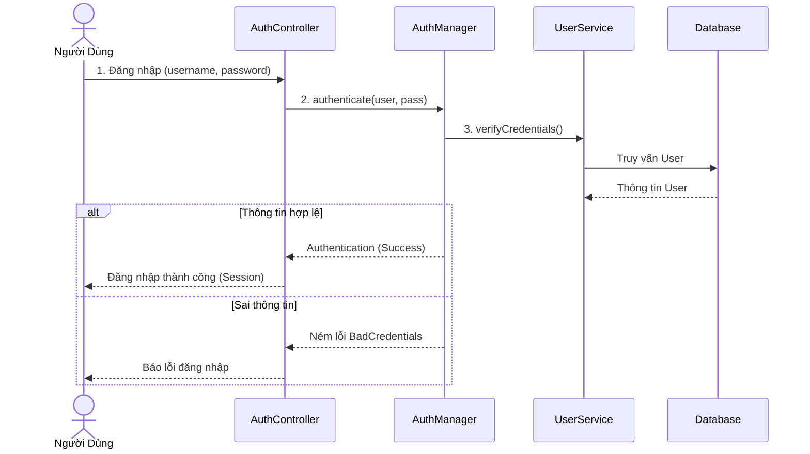
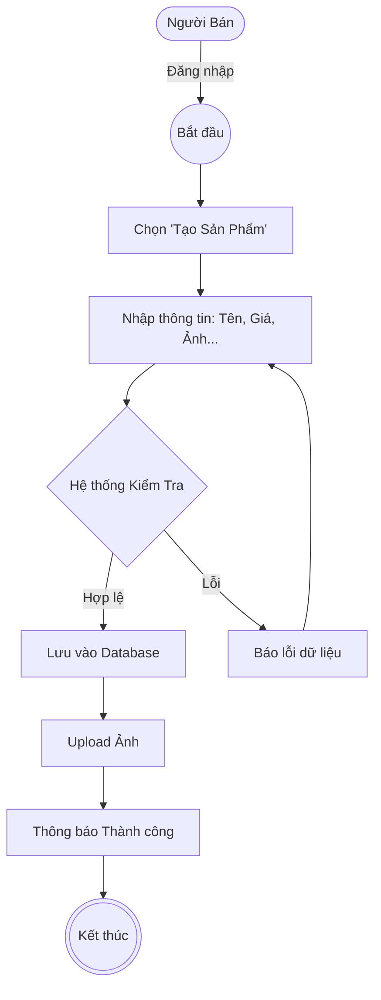
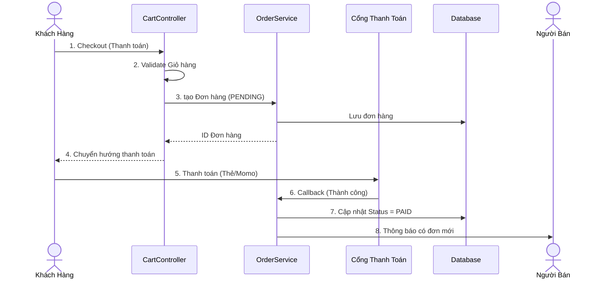
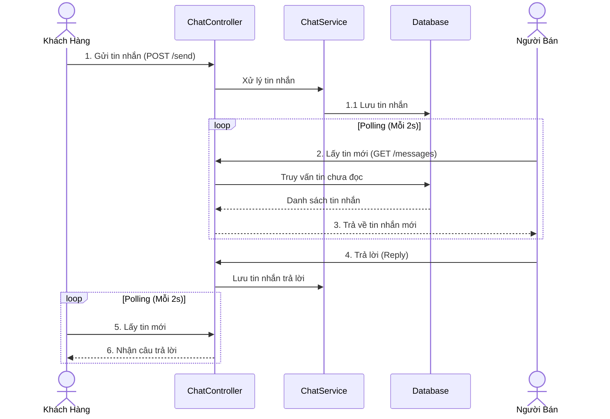

# BÁO CÁO ĐỒ ÁN MÔN HỌC

## TÊN ĐỀ TÀI: XÂY DỰNG WEBSITE THƯƠNG MẠI ĐIỆN TỬ "BẢN ĐẮC SẢN"

---

## MỤC LỤC

1.  **Chương 1: Tổng Quan Đề Tài**
2.  **Chương 2: Phân Tích & Thiết Kế Hệ Thống**
3.  **Chương 3: Hiện Thực Các Chức Năng Chi Tiết (Theo Role)**
    3.1. Role Guest & Common (Xác Thực)
    3.2. Role Vendor (Người Bán)
    3.3. Role Customer (Người Mua)
    3.4. Role Admin (Quản Trị Viên)
4.  **Chương 4: Kết Luận**

---

## CHƯƠNG 1: TỔNG QUAN ĐỀ TÀI
"Bản Đắc Sản" là sàn thương mại điện tử kết nối người bán đặc sản vùng miền với người tiêu dùng. Hệ thống được xây dựng trên nền tảng **Java Spring Boot**, sử dụng **MySQL** làm cơ sở dữ liệu và **Thymeleaf** cho giao diện.

---

## CHƯƠNG 2: PHÂN TÍCH & THIẾT KẾ HỆ THỐNG

### 2.1. Lược đồ Use Case (Tổng Quát)


### 2.2. Sơ đồ Cơ Sở Dữ Liệu (ERD)


---

## CHƯƠNG 3: HIỆN THỰC CÁC CHỨC NĂNG CHI TIẾT (THEO ROLE)

### 3.1. ROLE GUEST & COMMON (XÁC THỰC)
Chức năng dành cho mọi người dùng: Đăng ký, Đăng nhập và Bảo mật.

#### 3.1.1. Lược đồ Tuần Tự (Authentication)


#### 3.1.2. Source Code
**SecurityConfig.java** (Cấu hình phân quyền):
```java
@Configuration
@EnableWebSecurity
public class SecurityConfig {
    @Bean
    public SecurityFilterChain filterChain(HttpSecurity http) throws Exception {
        http.csrf(AbstractHttpConfigurer::disable)
            .authorizeHttpRequests(auth -> auth
                .requestMatchers("/api/auth/**", "/login", "/register", "/", "/home").permitAll()
                .requestMatchers("/admin/**").hasRole("ADMIN")
                .requestMatchers("/vendor/**").hasRole("VENDOR")
                .requestMatchers("/user/**").hasRole("CUSTOMER")
                .anyRequest().authenticated()
            )
            .formLogin(form -> form
                .loginPage("/login")
                .defaultSuccessUrl("/home")
                .permitAll()
            )
            .logout(logout -> logout.logoutSuccessUrl("/login?logout"));
        return http.build();
    }
}
```

**AuthController.java** (Xử lý Đăng ký):
```java
@RestController
@RequestMapping("/api/auth")
@RequiredArgsConstructor
public class AuthController {
    private final IUserService userService;

    @PostMapping("/register")
    public ResponseEntity<?> register(@RequestBody UserRequestDTO dto) {
        try {
            return ResponseEntity.ok(userService.register(dto));
        } catch (Exception e) {
            return ResponseEntity.badRequest().body(e.getMessage());
        }
    }
}
```

---

### 3.2. ROLE VENDOR (NGƯỜI BÁN)
Phân hệ này cung cấp công cụ mạnh mẽ để Người bán quản lý gian hàng, sản phẩm và theo dõi doanh thu.

#### 3.2.1. Quản Lý Sản Phẩm (CRUD)
Người bán có thể xem danh sách, thêm mới và quản lý kho hàng của mình.

**Lược đồ Hoạt Động (Quy Trình Tạo Sản Phẩm):**


**VendorContentController.java** (Xử lý sản phẩm):
```java
@Controller
@RequestMapping("/vendor")
public class VendorContentController {

    // Xem danh sách sản phẩm
    @GetMapping("/products")
    public String products(Model model, HttpSession session) {
        User user = (User) session.getAttribute("user");
        var vendor = vendorRepository.findVendorByUser_Id(user.getId()).orElse(null);
        
        // Lọc sản phẩm thuộc về Vendor này
        List<Product> products = productService.getAll().stream()
                .filter(p -> p.getVendorId().equals(vendor.getId()))
                .collect(Collectors.toList());
        model.addAttribute("products", products);
        return "vendor/product/list";
    }

    // Tạo sản phẩm mới
    @PostMapping("/products/create")
    public String createProduct(ProductRequestDTO request, HttpSession session) {
        User user = (User) session.getAttribute("user");
        Vendor vendor = vendorRepository.findVendorByUser_Id(user.getId()).get();

        // Gán Vendor ID cho sản phẩm
        request.setVendorId(vendor.getId());
        productService.create(request, null); 
        
        return "redirect:/vendor/products";
    }
}
```

#### 3.2.2. Quản Lý Đơn Hàng & Doanh Thu
Vendor chỉ nhìn thấy các đơn hàng có chứa sản phẩm của mình. Doanh thu được tính dựa trên các item thuộc về Vendor trong các đơn hàng đã giao thành công.

**VendorContentController.java** (Orders & Revenue):
```java
@GetMapping("/orders")
public String orders(Model model, HttpSession session) {
    User user = (User) session.getAttribute("user");
    Vendor vendor = vendorRepository.findVendorByUser_Id(user.getId()).get();

    // 1. Lọc đơn hàng liên quan đến Vendor
    List<Order> allOrders = orderRepository.findAll();
    List<OrderDTO> vendorOrders = allOrders.stream()
            .filter(order -> order.getItems().stream()
                    .anyMatch(item -> item.getProduct().getVendor().getId().equals(vendor.getId())))
            .map(order -> orderService.getOrderByIdForVendor(order.getId(), vendor.getId()))
            .collect(Collectors.toList());

    // 2. Tính toán thống kê
    long deliveredCount = vendorOrders.stream()
            .filter(o -> o.getStatus() == OrderStatus.DELIVERED).count();
    
    // Tính tổng doanh thu
    double totalRevenue = vendorOrders.stream()
            .filter(o -> o.getStatus() == OrderStatus.DELIVERED)
            .mapToDouble(OrderDTO::getTotalAmount)
            .sum();

    model.addAttribute("orders", vendorOrders);
    model.addAttribute("totalRevenue", totalRevenue);
    return "vendor/orders";
}

@GetMapping("/revenue")
public String revenue(Model model, HttpSession session) {
    // Logic tính doanh thu theo Tuần/Tháng để vẽ biểu đồ
    // ... (Code tính toán chi tiết xem file source gốc)
    return "vendor/revenue";
}
```

#### 3.2.3. Hệ Thống Chat (Phía Vendor)
Vendor quản lý danh sách các phòng chat với khách hàng.

**VendorChatController.java**:
```java
@Controller
@RequestMapping("/vendor/chat")
public class VendorChatController {

    // Xem danh sách các cuộc hội thoại
    @GetMapping
    public String chatRooms(HttpSession session, Model model) {
        User user = (User) session.getAttribute("user");
        // Lấy danh sách phòng chat mà Vendor tham gia
        List<ChatRoomDTO> rooms = chatService.getUserChatRooms(user.getId());
        model.addAttribute("chatRooms", rooms);
        return "vendor/chat-rooms";
    }

    // Chat trong một phòng cụ thể
    @GetMapping("/room/{roomId}")
    public String chatRoom(@PathVariable Long roomId, Model model) {
        // ... Load tin nhắn cũ
        return "vendor/chat-room";
    }
}
```

---

### 3.3. ROLE CUSTOMER (NGƯỜI MUA)
Đây là phân hệ quan trọng nhất, nơi diễn ra các hoạt động giao dịch chính của hệ thống. Người mua có thể xem sản phẩm, quản lý giỏ hàng, thanh toán, theo dõi đơn hàng và tương tác với người bán.

#### 3.3.1. Trang Chủ & Xem Sản Phẩm
Khách hàng truy cập trang chủ để xem các sản phẩm mới nhất và danh mục sản phẩm.

**UserPageController.java** (Hiển thị trang chủ):
```java
@Controller
public class UserPageController {

    @Autowired
    private IProductService productService;
    @Autowired
    private ICategoryService categoryService;

    @GetMapping({"/user", "/user/home"})
    public String home(Model model) {
        try {
            // Lấy 8 sản phẩm mới nhất để hiển thị
            Pageable pageable = PageRequest.of(0, 8, Sort.by("id").descending());
            Page<ProductResponseDTO> products = productService.getAll(pageable);
            model.addAttribute("latestProducts", products.getContent());

            // Lấy danh sách danh mục
            model.addAttribute("categories", categoryService.getAll());
        } catch (Exception e) {
            e.printStackTrace();
            model.addAttribute("latestProducts", Collections.emptyList());
        }
        return "user/home";
    }
}
```

#### 3.3.2. Giỏ Hàng (Shopping Cart)
Quy trình thêm vào giỏ, cập nhật số lượng và xóa sản phẩm.

**CartController.java** (Xử lý Giỏ hàng):
```java
@Controller
@RequestMapping("/user/cart")
@RequiredArgsConstructor
public class CartController {

    private final ICartService cartService;

    // Xem giỏ hàng
    @GetMapping
    public String viewCart(HttpSession session, Model model) {
        User user = (User) session.getAttribute("user");
        if (user == null) return "redirect:/login";

        CartDTO cart = cartService.getCartByUserId(user.getId());
        model.addAttribute("cart", cart);
        return "user/cart";
    }

    // Thêm sản phẩm vào giỏ (AJAX)
    @PostMapping("/add")
    @ResponseBody
    public ResponseEntity<?> addToCart(@RequestBody CartRequestDTO request, HttpSession session) {
        User user = (User) session.getAttribute("user");
        if (user == null) return ResponseEntity.status(401).body("Vui lòng đăng nhập");

        try {
            cartService.addToCart(user.getId(), request);
            return ResponseEntity.ok("Đã thêm vào giỏ hàng!");
        } catch (Exception e) {
            return ResponseEntity.badRequest().body(e.getMessage());
        }
    }
    
    // Cập nhật số lượng
    @PostMapping("/update")
    public String updateCartItem(@RequestParam Long itemId, @RequestParam Integer quantity, HttpSession session) {
        User user = (User) session.getAttribute("user");
        cartService.updateCartItem(user.getId(), itemId, quantity);
        return "redirect:/user/cart";
    }
}
```

#### 3.3.3. Đặt Hàng & Thanh Toán (Checkout)
Quy trình xác nhận đơn hàng, chọn phương thức thanh toán (COD hoặc Momo) và hoàn tất đơn hàng.

**Lược đồ Tuần tự (Order Process):**


**CheckoutController.java** (Xử lý Thanh toán):
```java
@Controller
@RequestMapping("/user/checkout")
@RequiredArgsConstructor
public class CheckoutController {

    private final IOrderService orderService;
    private final MomoService momoService;

    // Trang xác nhận thanh toán
    @GetMapping
    public String checkoutPage(HttpSession session, Model model) {
        User user = (User) session.getAttribute("user");
        // ... logic lấy giỏ hàng để hiển thị
        return "user/checkout";
    }

    // Xử lý tạo đơn hàng
    @PostMapping(consumes = MediaType.APPLICATION_JSON_VALUE)
    public ResponseEntity<?> processCheckout(@RequestBody CheckoutRequestDTO request, HttpSession session) {
        User user = (User) session.getAttribute("user");
        
        // 1. Tạo đơn hàng (Trạng thái PENDING)
        OrderDTO orderDTO = orderService.createOrder(user.getId(), request);

        // 2. Xử lý thanh toán Momo nếu được chọn
        if ("MOMO".equalsIgnoreCase(request.getPaymentMethod())) {
            vn.edu.hcmute.springboot3_4_12.entity.Order order = orderService.findOrderById(orderDTO.getId());
            String payUrl = momoService.getMomoPayUrl(order);
            return ResponseEntity.ok(Map.of("payUrl", payUrl));
        }

        // 3. Trả về thành công (COD)
        return ResponseEntity.ok(orderDTO);
    }
}
```

#### 3.3.4. Quản Lý Thông Tin Cá Nhân (Profile)
Cho phép người dùng cập nhật thông tin cá nhân và mật khẩu.

**UserProfileController.java**:
```java
@Controller
public class UserProfileController {

    @Autowired
    private IUserService userService;

    @GetMapping("/profile")
    public String profile(HttpSession session, Model model) {
        User user = (User) session.getAttribute("user");
        model.addAttribute("user", user);
        return "user/profile";
    }

    @PostMapping("/profile/update")
    public String updateProfile(@RequestParam Long id, 
                              @RequestParam String username,
                              @RequestParam String password, 
                              RedirectAttributes redirectAttributes) {
        // Logic validation password, cập nhật DB
        UserRequestDTO dto = new UserRequestDTO();
        dto.setUsername(username);
        if (password != null && !password.isEmpty()) {
            dto.setPassword(password);
        }
        userService.update(id, dto);
        
        redirectAttributes.addFlashAttribute("successMessage", "Cập nhật thành công!");
        return "redirect:/profile";
    }
}
```

#### 3.3.5. Hệ Thống Chat (Tương tác với Shop)
Người mua có thể chat trực tiếp với người bán để hỏi về sản phẩm.

**Lược đồ Tuần tự (Chat System):**


**ChatController.java**:
```java
@Controller
@RequestMapping("/user/chat")
public class ChatController {

    @PostMapping("/send")
    @ResponseBody
    public ChatMessageDTO sendMessage(@RequestParam Long roomId, @RequestParam String message, HttpSession session) {
        User user = (User) session.getAttribute("user");
        return chatService.sendMessage(roomId, user.getId(), message);
    }

    @GetMapping("/room/{roomId}/messages")
    @ResponseBody
    public List<ChatMessageDTO> getRoomMessages(@PathVariable Long roomId) {
        // Polling tin nhắn mới
        return chatService.getRoomMessages(roomId);
    }
}
```

---

### 3.4. ROLE ADMIN (QUẢN TRỊ VIÊN)
Admin có quyền cao nhất, quản lý toàn bộ dữ liệu nền tảng, bao gồm người dùng, danh mục sản phẩm và toàn bộ sản phẩm trên hệ thống.

#### 3.4.1. Quản Lý Người Dùng
Admin có thể xem danh sách, tạo mới, chỉnh sửa và xóa người dùng.

**AdminUserPageController.java**:
```java
@Controller
@RequestMapping("/admin/users")
public class AdminUserPageController {

    // Tạo người dùng mới (Bao gồm set Role)
    @PostMapping("/create")
    public String createSubmit(HttpServletRequest request, RedirectAttributes redirectAttributes) {
        UserRequestDTO dto = new UserRequestDTO();
        dto.setUsername(request.getParameter("username"));
        dto.setPassword(request.getParameter("password"));
        dto.setEmail(request.getParameter("email"));
        dto.setRole(request.getParameter("role")); // ADMIN, VENDOR, CUSTOMER

        userService.register(dto);
        redirectAttributes.addFlashAttribute("successMessage", "Tạo người dùng thành công!");
        return "redirect:/admin/users";
    }

    // Xóa người dùng
    @PostMapping("/delete")
    public String deleteUser(HttpServletRequest request, RedirectAttributes redirectAttributes) {
        String username = request.getParameter("username");
        UserResponseDTO user = userService.findByUsername(username);
        if (user != null) {
            userService.deleteUser(user.id());
        }
        return "redirect:/admin/users";
    }
}
```

#### 3.4.2. Quản Lý Danh Mục (Categories)
Quản lý cây danh mục sản phẩm cho toàn hệ thống.

**AdminCategoryPageController.java**:
```java
@Controller
@RequestMapping("/admin/categories")
public class AdminCategoryPageController {

    @GetMapping("/create")
    public String createForm() {
        return "admin/category/create";
    }

    @PostMapping("/create")
    public String createSubmit(CategoryRequestDTO dto, RedirectAttributes redirectAttributes) {
        categoryService.create(dto);
        redirectAttributes.addFlashAttribute("successMessage", "Tạo danh mục thành công!");
        return "redirect:/admin/categories";
    }

    @PostMapping("/delete")
    public String deleteCategory(@RequestParam Long id, RedirectAttributes redirectAttributes) {
        categoryService.delete(id);
        redirectAttributes.addFlashAttribute("successMessage", "Đã xóa danh mục!");
        return "redirect:/admin/categories";
    }
}
```

#### 3.4.3. Quản Lý Sản Phẩm Hệ Thống
Admin quyền can thiệp vào bất kỳ sản phẩm nào (ví dụ: gỡ bỏ sản phẩm vi phạm).

**ProductPageController.java** (Admin):
```java
@Controller
@RequestMapping("/admin/products")
public class ProductPageController {
    
    // Admin thấy tất cả sản phẩm của mọi Vendor
    @GetMapping
    public String listPage(Model model) {
        model.addAttribute("products", productService.getAll());
        return "admin/product/list";
    }

    // Admin chỉnh sửa sản phẩm của bất kỳ ai
    @GetMapping("/{id}/edit")
    public String editPage(@PathVariable Long id, Model model) {
        var product = productService.findById(id);
        model.addAttribute("product", product);
        model.addAttribute("vendors", vendorService.findAll()); // Admin có thể đổi Vendor chủ sở hữu
        return "admin/product/form";
    }

    @PostMapping("/save")
    public String saveProduct(ProductRequestDTO request, RedirectAttributes redirectAttributes) {
        // Logic update sản phẩm...
        productService.update(request.getId(), request);
        return "redirect:/admin/products";
    }
}
```

---

## CHƯƠNG 4: KẾT LUẬN
Báo cáo đã trình bày chi tiết việc thiết kế và hiện thực hệ thống thương mại điện tử "Bản Đắc Sản" theo mô hình phân quyền rõ ràng:
*   **Common**: Bảo mật, xác thực người dùng.
*   **Vendor**: Cung cấp công cụ mạnh mẽ để quản lý gian hàng.
*   **Customer**: Trải nghiệm mua sắm và tương tác mượt mà.
*   **Admin**: Công cụ quản trị hệ thống toàn diện.

Hệ thống đáp ứng tốt các yêu cầu chức năng đặt ra và có khả năng mở rộng trong tương lai.
